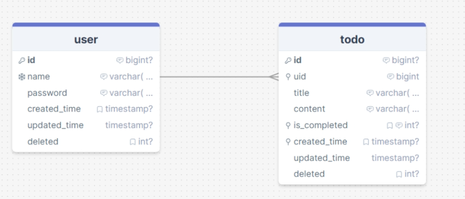

# 待办项目
一个微服务框架下的待办项目

# 项目简介

## 项目技术栈
- SpringBootWeb开发框架
- MySQL 数据库
- Redis 非关系型数据库
- Dubbo 微服务通信
- Nacos 注册中心
- MyBatis 持久层框架

## 数据库设计



**通用字段**

- created_time 创建时间 索引列
- updated_time 更新时间
- deleted 逻辑删除

**用户表**

- id 自增
- name 用户名 唯一
- password md5加密密码

**待办表**

- id 主键
- uid 创建用户id
- title 待办标签 不能包含非法字符
- content 待办内容


## 项目树

```bash
├─Base
 │  └─src
 │      ├─main
 │      │  ├─java
 │      │  │  └─com
 │      │  │      └─shaoxia
 │      │  │          ├─common
 │      │  │          │  ├─constant
 │      │  │          │  ├─exception
 │      │  │          │  └─utils
 │      │  │          ├─model
 │      │  │          │  ├─dto
 │      │  │          │  │  ├─req
 │      │  │          │  │  └─resp
 │      │  │          │  └─pojo
 │      │  │          └─service
 │      │  └─resources
 ├─docs
 │  └─sql
 ├─TodoServiceProvider
 │  └─src
 │      ├─main
 │      │  ├─java
 │      │  │  └─com
 │      │  │      └─shaoxia
 │      │  │          └─todo
 │      │  │              ├─config
 │      │  │              ├─controller
 │      │  │              ├─mapper
 │      │  │              └─service
 │      │  │                  └─impl
 │      │  └─resources
 │      │      └─mybatis
 │      │          └─mapper
 └─UserServiceProvider
     └─src
         ├─main
         │  ├─java
         │  │  └─com
         │  │      └─shaoxia
         │  │          └─user
         │  │              ├─config
         │  │              ├─controller
         │  │              ├─mapper
         │  │              └─service
         │  │                  └─impl
         │  └─resources
         │      └─mybatis
         │          └─mapper
```


## 项目架构图


## 业务流程图


